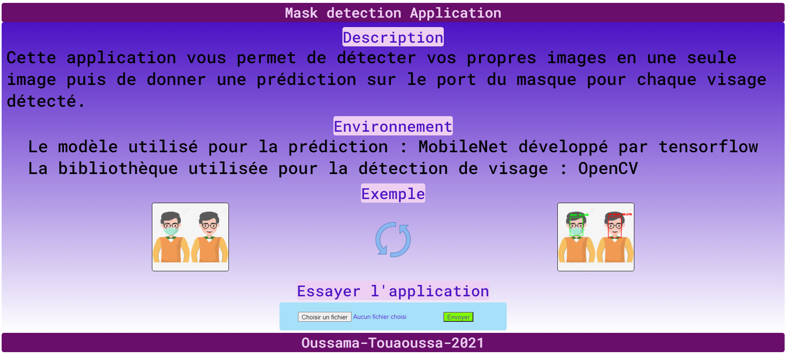

<h1> Description <h1>

 Cette application vous permet de détecter vos propres images en une seule image puis de donner une prédiction sur le port du masque pour chaque visage détecté. 

<h1> Environnement </h1>

 Le modèle utilisé pour la prédiction : MobileNet développé par tensorflow 

 La bibliothèque utilisée pour la détection de visage : OpenCV 

 L'application web est à base de django 

<h1> Aperçu de l'application : </h1>

<h1> Pour démarrer l'application <h1>

 Installer les dépendances 

 Ouvrir le terminal dans le dossier MaskDetectionProject 

 Tapez : python manage.py runserver 

